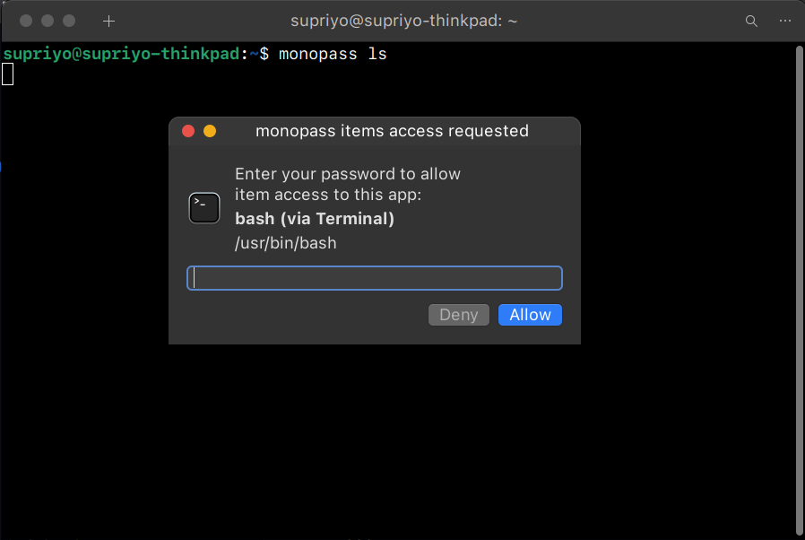

# Getting started

monopass is a local, CLI-first password manager. This guide will walk you through installing monopass, initializing your password database, and understanding how to approve access requests.

## Install the binary

monopass is currently supported on Linux (x86_64/aarch64) and macOS (Apple Silicon). Run the following command to install it:

```sh
curl -fsSL https://raw.githubusercontent.com/supriyo-biswas/monopass/master/install.sh | sh
```

The script downloads the binary to `$HOME/.local/bin` by default and configures completion for your default shell. On Linux, it selects a desktop or CLI variant according to the current environment.

Once the install completes, run the following to verify the installation:

```sh
monopass --version
```

On success, the command prints a version number:

```
$ monopass --version
monopass 0.0.1-alpha16
```

If the command fails with `command not found`, restart your shell or terminal window.

## Create the encrypted database

monopass stores its data in a [SQLCipher](https://www.zetetic.net/sqlcipher/) encrypted database. Before you get started with saving passwords, initialize it:

```sh
monopass init
```

Choose a strong, unique master password that is at least 10 characters long. It cannot be recovered if you forget it, so store any written backup somewhere safe, such as in a safe deposit box at your bank.

monopass uses a background agent to handle operations on the encrypted password database. In almost all cases, you will want to answer `y` to configure its auto-start. The whole flow looks like this:

```
$ monopass init
Enter master password:
Confirm master password:
Initialized /home/you/.local/share/monopass/monopass.db
Configure agent auto-start? [y/n] y
Configured agent auto-start
```

After auto-start is configured, continue to [approve your first request](#approve-your-first-request).

If you don't want to run the agent automatically, or encounter an error such as `auto-start configuration failed` on Linux, refer to [running the agent manually](#running-the-agent-manually).

## Running the agent manually

On Linux distributions without systemd, auto-start is unavailable. In other cases, you may want to run the agent manually. Start it in one terminal and leave it open:

```
$ monopass agent
Listening on /run/user/501/monopass/agent.sock
```

From another terminal, use `monopass` commands normally.

## Approve your first request

In [chapter 2](./02-creating-dirs-and-items.md) we'll see how you can create and manage your credentials. But first, you'll need to learn how to approve monopass access requests. Run the following command:

```sh
monopass ls
```

On macOS or desktop Linux, you'll see an unlock window like the one below:



Check that the application and command shown in the prompt are the ones you expected before entering your master password. For example, a terminal request may identify Terminal and its `bash` shell, as seen above.

On a headless Linux system, you'll receive an inline master-password prompt:

```
$ monopass ls
Enter master password:
```

After entering your master password, the default `Personal` directory appears:

```
$ monopass ls
Personal
```

If the password is wrong, monopass reports `403 access_denied: access denied`. Run `monopass ls` again to retry.

When you approve a request, monopass remembers the process tree (such as `Terminal → bash → monopass`) and allows all further access requests from that tree for 15 minutes. A command from another terminal, shell, or independently launched application is a different request path and needs its own approval.

On the GUI prompt, press the <kbd>Esc</kbd> key to close the password prompt without allowing the access request. You can also click **Deny**, which temporarily prevents that requesting application from requesting access for 60 seconds to prevent badly behaved applications from requesting your password repeatedly. When you click **Deny**, you'll see the error `403 temporary_lockout: temporarily locked out after denial`.

| Previous chapter | Next chapter |
| --- | --- |
| — | [Creating directories and items](02-creating-dirs-and-items.md) |
